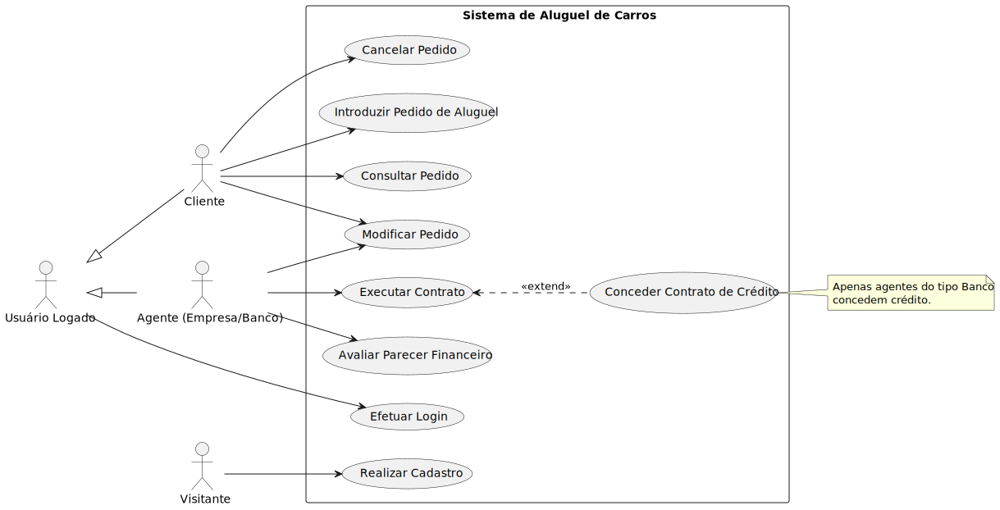
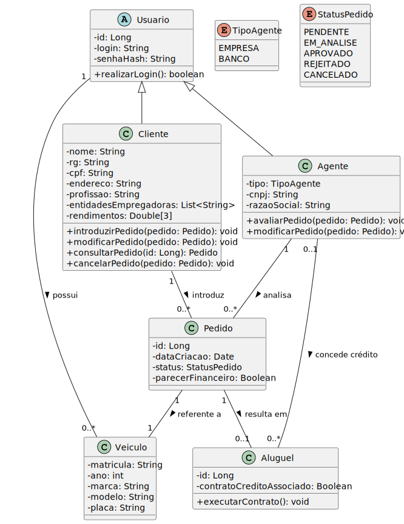

# DriveFlix - Sistema de Aluguel de Carros

## Atividade Prática da Disciplina Projeto de Software


[](https://sonarcloud.io/summary/new_code?id=jjoaom_PS-PUCMG-DriveFlix)
[](https://sonarcloud.io/summary/new_code?id=jjoaom_PS-PUCMG-DriveFlix)
[](https://sonarcloud.io/summary/new_code?id=jjoaom_PS-PUCMG-DriveFlix)
[](https://sonarcloud.io/summary/new_code?id=jjoaom_PS-PUCMG-DriveFlix)
[](https://sonarcloud.io/summary/new_code?id=jjoaom_PS-PUCMG-DriveFlix)
[](https://sonarcloud.io/summary/new_code?id=jjoaom_PS-PUCMG-DriveFlix)
[](https://sonarcloud.io/summary/new_code?id=jjoaom_PS-PUCMG-DriveFlix)
[](https://sonarcloud.io/summary/new_code?id=jjoaom_PS-PUCMG-DriveFlix)
[](https://sonarcloud.io/summary/new_code?id=jjoaom_PS-PUCMG-DriveFlix)

**O escopo da atividade por ser acessado [por aqui](./docs/LABORATÓRIO%2002%20-%20Sistema%20de%20Aluguel%20de%20Carros.pdf).**

## Integrantes

- Diogo Henrique Moreira da Silva
- João Marcos de Aquino Gonçalves
- João Victor dos Santos Nogueira

## Professor

- João Paulo Aramuni


# Como usar

## BackEnd
Para rodar a aplicação backend, acesse o terminal no diretório `/code` e digite:
```
docker-compose up
```

A aplicação será acessada através de ´localhost:8080´

## FrontEnd
Para rodar a aplicação frontend, acesse o terminal no diretório `/code/frontend` e digite:

```
npm run dev
```
A aplicação será acessada através de ´localhost:5173´

# Documentação

* Diagrama de Casos de Uso
> 

* Histórias do Usuário
>


* Requisitos
>
>
>


* Diagrama de Classes
>

* Diagrama de Pacotes
>

* Diagrama de Componentes
>

* Diagrama de Implanação
>
