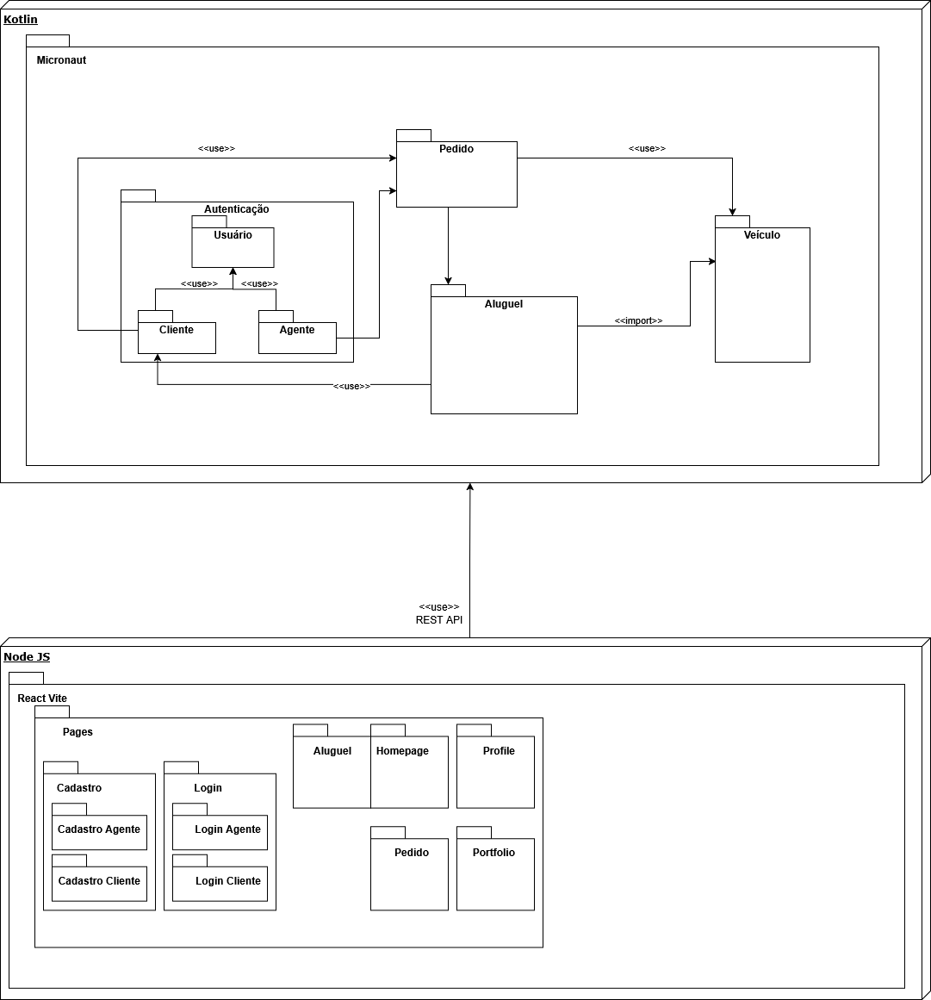

# DriveFlix - Sistema de Aluguel de Carros

## Atividade Prática da Disciplina Projeto de Software

**O escopo da atividade por ser acessado [por aqui](./docs/LABORATÓRIO%2002%20-%20Sistema%20de%20Aluguel%20de%20Carros.pdf).**

## Integrantes

- Diogo Henrique Moreira da Silva
- João Marcos de Aquino Gonçalves
- João Victor dos Santos Nogueira

## Professor

- João Paulo Aramuni

# Documentação

* Diagrama de Casos de Uso
> TO DO

* Histórias do Usuário
> TO DO

* Diagrama de Classes
> TO DO

* Diagrama de Pacotes
> ON GOING

